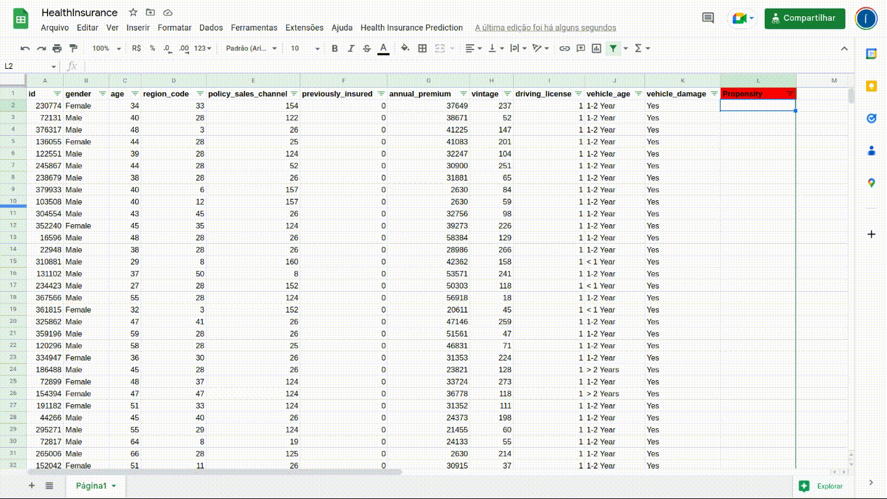
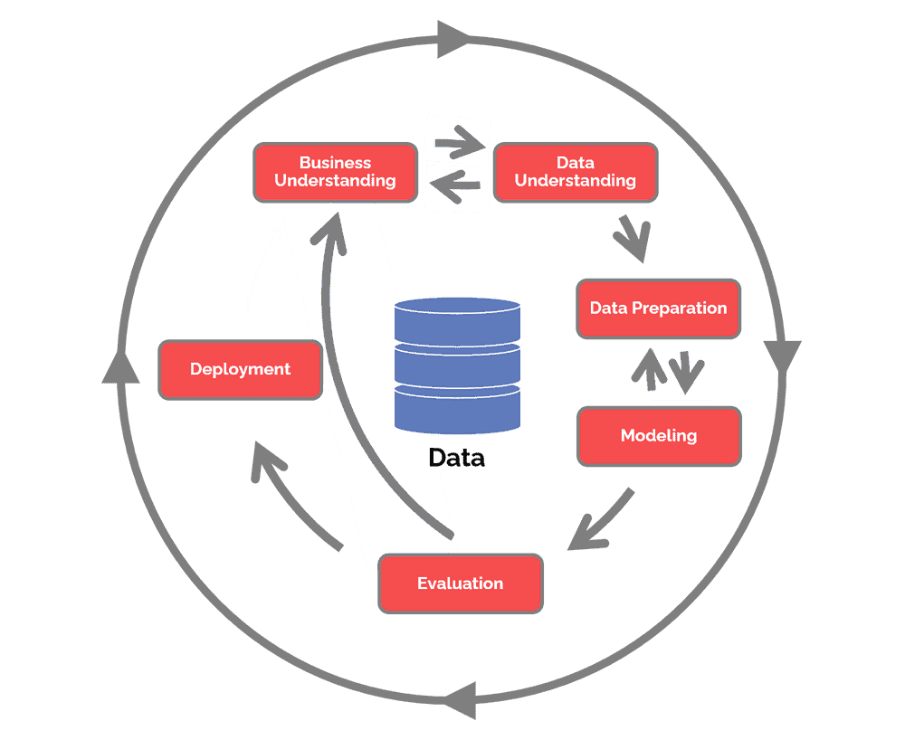
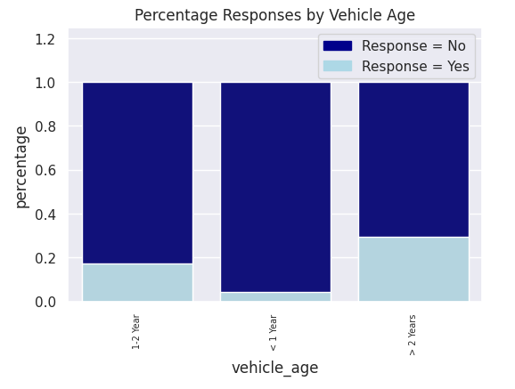
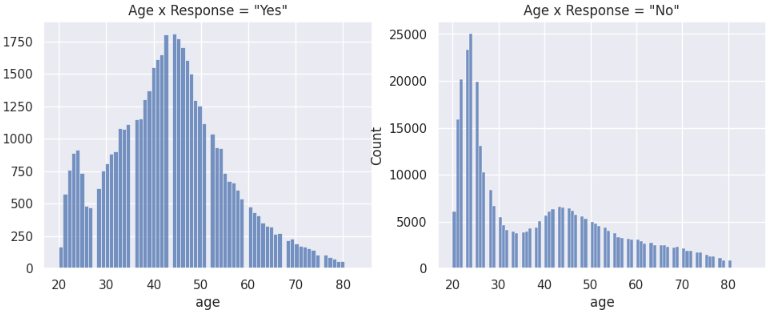
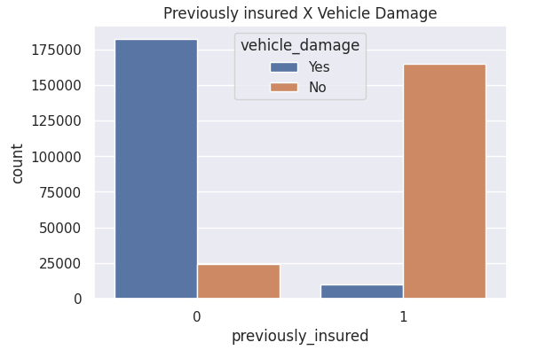
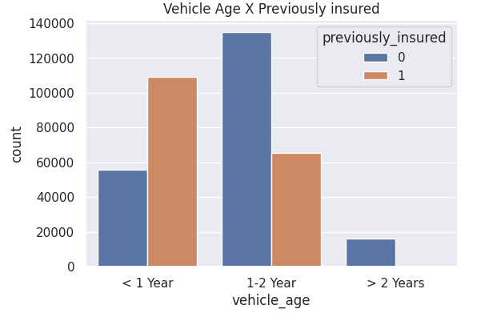
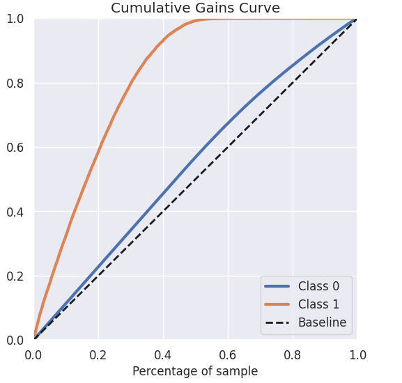
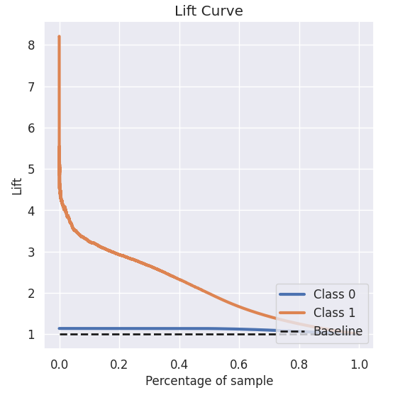
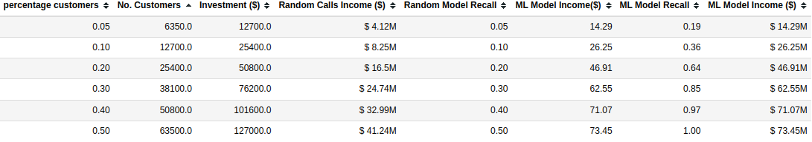
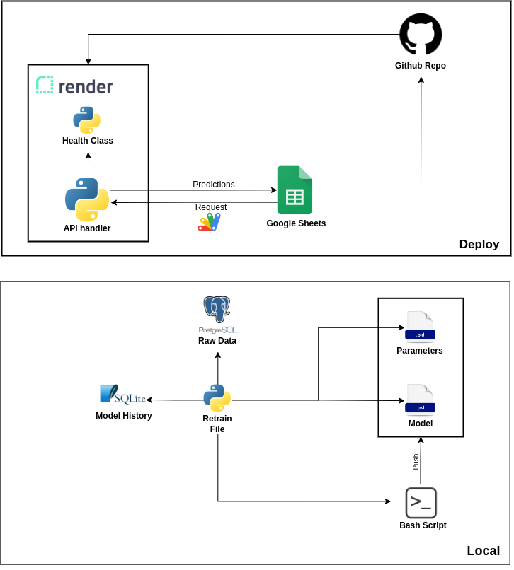

# Health Insurance Cross-Selling
*Using Machine Learning to rank a list of customers most likely to buy a Car Insurance for a cross-sell campaign*

 
*The in-depth Python code explanation is available in [this](https://nbviewer.org/github/igorvgp/DS-health-insurance-cross-sell/blob/a9b98fa99501fc392dcd7942fc1c18b3c4999f20/Notebooks/health-insurance-cross-sell.html) Jupyter Notebook.*
## 1. Abstract

This Data Science Project was inspired by this <a href="https://www.kaggle.com/datasets/anmolkumar/health-insurance-cross-sell-prediction">kaggle Challenge</a> and presents the development of a Classification Machine Learning Model, more specifically a Learning to Rank Model, used to generate a propensity score to purchase a new product for a company's customer list.

An Insurance company that has provided Health Insurance to its customers need to predict whether the policyholders (customers) from past year will also be interested in Car Insurance provided by the company.
With the information about customers, the company did a survey asking them if they were interested in car insurance. With the results of this survey and the characteristics of the customers, the company is able to maximize profit through Machine Learning techniques and identify customers with a greater propensity to purchase a new insurance, since they company only have the resourses to call 20,000 customers.

The solution was delivered through a "Get Prediction" button on Google Sheets that returns the purchase propensity of each customer on the list. Thus, sellers can target customers who have the highest chance of purchasing insurance.

A demo of the solution can be seen in the gif below:

Compared to a random selection of customers to be contacted, the machine learning model developed proved to be about <strong>3 times</strong> more efficient, generating an extra gain of <strong>35 million dollars</strong>.

The full solution can be seen on this [Notebook](https://nbviewer.org/github/igorvgp/DS-health-insurance-cross-sell/blob/a9b98fa99501fc392dcd7942fc1c18b3c4999f20/Notebooks/health-insurance-cross-sell.html)

## 2. Methodology

To develop this project, the CRISP-DM methodology was used, aiming at delivering the solution efficiently, and evolving at each cycle.

To direct your reading, below are links to the development carried out at each stage of the CRISP cycle:

* [Business Understanding](#3-business-undestanding)
* [Data Understanding](#4-data-understanding)
* [Data Preparation](#5-data-preparation)
* [Machine Learning Modeling](#6-machine-learning-modeling)
* [Model Performance](#7-model-performance)
* [Deploy](#8-deploy)
* [Lessons Learned](#9-lessons-learned)
* [Next Steps to Improve](#10-next-steps-to-improve)

## 3. Business Undestanding

### 3.1. Context

The CEO of a Health Insurance company wants to expand the business by offering Car Insurance. The company carried out a customer survey in which they had to answer whether they would buy car insurance from the company. 381109 customers answered the survey and the results were saved in the database along with other customer attributes.

Now, the company is ready to launch the new service, and the sales team have a list of 127,000 customers to make phone calls and offer the new Insurance. Considering that the sales team has the capacity to make 20,000 calls within the campaign period, the goal is to build a solution that ranks the customers most likely to buy the new service.

The features of the database are described below:

| Feature                | Definition                                                                                               |
|------------------------|----------------------------------------------------------------------------------------------------------|
| id                     | Unique ID for the customer                                                                               |
| gender                 | Gender of the customer                                                                                   |
| age                    | Age of the customer                                                                                      |
| driving_license        | 0 : Customer does not have DL, 1 : Customer already has DL                                               |
| region_code            | Unique code for the region of the customer                                                               |
| previously_insured     | 1 : Customer already has Vehicle Insurance, 0 : Customer doesn't have Vehicle Insurance                  |
| vehicle_age            | Age of the Vehicle                                                                                       |
| vehicle_damage         | 1 : Customer got his/her vehicle damaged in the past. 0 : Customer didn't get his/her vehicle damaged in the past. |
| anual_pemium           | The amount customer needs to pay as premium in the year                                                  |
| policysaleschannel     | Anonymized Code for the channel of outreaching to the customer ie. Different Agents, Over Mail, Over Phone, In Person, etc. |
| vintage                | Number of Days, Customer has been associated with the company                                            |
| response               | 1 : Customer is interested, 0 : Customer is not interested                                               |

*Source:* [Kaggle](https://www.kaggle.com/datasets/anmolkumar/health-insurance-cross-sell-prediction)

### 3.2. Business Assumptions

- Customers who already have Health Insurance may also be interested in Auto Insurance.
	
- Cross-selling increases customer loyalty.
	
- Learning from cross-selling can become a horizontal strategy for the company in the market.
	
- A machine learning model to rank customers most likely to buy will increase sales force productivity and accelerate new market entry.
	
[Back to the top](#1-abstract) | [View Notebook](https://nbviewer.org/github/igorvgp/DS-health-insurance-cross-sell/blob/a9b98fa99501fc392dcd7942fc1c18b3c4999f20/Notebooks/health-insurance-cross-sell.html)

## 4. Data Understanding

### 4.1. Main Insights

##### Hypothesis 1: Customers with new cars are more interested in insurance

Result: False

Customers with older vehicles are more likely to buy car insurance.
 
##### Hypothesis 2. Older people are more interested in auto insurance

Result: True

Customers between 33 and 52 years represent 58% of the interested group.

##### Hypothesis 3. Vehicles that are already insured have lower damage rate

Result: True

Vehicles that was previously insured have low damage rate.

##### Hypothesis 4. customers with new cars are more likely to have car insurance

Result: True

Most of the new cars are already insured, thats why the hypotesis 1 (Customers with new cars are more interested in insurance) is false.

[Back to the top](#1-abstract) | [View Notebook](https://nbviewer.org/github/igorvgp/DS-health-insurance-cross-sell/blob/a9b98fa99501fc392dcd7942fc1c18b3c4999f20/Notebooks/health-insurance-cross-sell.html)

## 5. Data Preparation

Most ML algorithms are prepared to work on data with certain patterns. Continuous variables should be as close to the normal distribution as possible, and categorical variables represented by text should be replaced with numbers.

There are many preprocessing technique such as standardization, rescaling and encoding. For the features of the dataset of this problem, the following techniques were applied:

- Annual Preminum: [Standard Scaler](https://scikit-learn.org/stable/modules/generated/sklearn.preprocessing.StandardScaler.html)
- Age: [Min Max Scaler](https://scikit-learn.org/stable/modules/generated/sklearn.preprocessing.MinMaxScaler.html)
- Vintage: [Min Max Scaler](https://scikit-learn.org/stable/modules/generated/sklearn.preprocessing.MinMaxScaler.html)
- Gender: [Label Encoding](https://www.mygreatlearning.com/blog/label-encoding-in-python/)
- Vehicle Damage: [Label Encoding](https://www.mygreatlearning.com/blog/label-encoding-in-python/)
- Region Code: [Frequency Encoding](https://datascience.stackexchange.com/questions/63749/why-does-frequency-encoding-work#:~:text=Frequency%20encoding%20is%20a%20widely,categorical%20features%20with%20high%20cardinality.)
- Policy Sales Channel: [Frequency Encoding](https://datascience.stackexchange.com/questions/63749/why-does-frequency-encoding-work#:~:text=Frequency%20encoding%20is%20a%20widely,categorical%20features%20with%20high%20cardinality.)

[Back to the top](#1-abstract) | [View Notebook](https://nbviewer.org/github/igorvgp/DS-health-insurance-cross-sell/blob/a9b98fa99501fc392dcd7942fc1c18b3c4999f20/Notebooks/health-insurance-cross-sell.html)

## 6. Machine Learning Modeling

For this business problem, five classification models were tested using 10-fold cross-validation:

- Logistic Regression
- K-Means
- Random Forest
- XGBost

The results obtained are shown below:

| Model Name           | Precision Top-K CV | Recall Top-K CV |      F1 Score CV |       AUC Score CV |  
|----------------------|--------------------|-----------------|------------------|--------------------|
| XGBoost              |    0.43 +/- 0.0102 | 0.06 +/- 0.0014 |  0.43 +/- 0.0019 |    0.85 +/- 0.0009 |
| Random Forest        |    0.39 +/- 0.0138 | 0.06 +/- 0.0017 |  0.42 +/- 0.0024 |    0.85 +/- 0.0013 |
| K-Nearest Neighbors  |    0.24 +/- 0.0071 |  0.03 +/- 0.001 |  0.12 +/- 0.0028 |     0.6 +/- 0.0024 |
| Logistic Regression  |     0.12 +/- 0.024 | 0.02 +/- 0.0034 |  0.35 +/- 0.0733 |    0.72 +/- 0.0947 |

The XGBoost Model was chosen because it presented the best results followed by the Random Forest model. As the training time of XGBoost model is two times faster than Random Forest, this model was the best option.

[Back to the top](#1-abstract) | [View Notebook](https://nbviewer.org/github/igorvgp/DS-health-insurance-cross-sell/blob/a9b98fa99501fc392dcd7942fc1c18b3c4999f20/Notebooks/health-insurance-cross-sell.html)

## 7. Model Performance

### 7.1. General Performance

After tuning the model, it presented the following results:

For ranking position =  2000:

    Recall: 0.06 

    Precison: 0.43

The cumulative gain curve the relationship between the number of customers contacted on the list ordered by the algorithm and the success rate. The closer the cumulative gains line is to the top-left corner of the chart, the greater the gain, the higher the proportion of the responders that are reached for the lower proportion of customers contacted.

The optimum point is about 30% of the candidates, so we can reach 80% of the customers interested in insurance.

The lift curve shows how good the model is compared to a random one, according to the number of customers contacted. Ex: Lift = 2 means that the model is two times better than a random one.

According to the lift curve, if we call about 30% of the available customers, the model will give results 2.7 times better than calling randomly.

### 7.2. Business Results

According to the information above, if the company call randomly 20,000 customers, the income will be around $ 13M

On the other hand, if the company call the 20,000 customers with higher probability of getting a Car Insurance defined by the model, the income will be around $ 43M.

### 7.3. Business Questions

##### 2. What percentage of customers interested in purchasing auto insurance will the sales team be able to contact by making 20,000 calls?

With 20,000 calls sales team will contact 52% of the interested customers.

##### 3. If the sales team capacity increases to 40,000 calls, what percentage of customers interested in purchasing auto insurance will the sales team be able to contact?

With 40,000 calls sales team will call 88% of the interested customers.

##### 4. How many calls does the sales team need to make to contact 80% of customers interested in purchasing auto insurance?

With 35,000 calls sales team will call 80% of the interested customers.

[Back to the top](#1-abstract) | [View Notebook](https://nbviewer.org/github/igorvgp/DS-health-insurance-cross-sell/blob/a9b98fa99501fc392dcd7942fc1c18b3c4999f20/Notebooks/health-insurance-cross-sell.html)

## 8. Deploy

The API with the ranking model is available to the company and can be accessed by Google Sheets, so the sales team can provide the customer information to get the ranking score.

A demo of the solution can be seen in the gif below:

To build this solution, the architecture below was used:

[Back to the top](#1-abstract) | [View Notebook](https://nbviewer.org/github/igorvgp/DS-health-insurance-cross-sell/blob/a9b98fa99501fc392dcd7942fc1c18b3c4999f20/Notebooks/health-insurance-cross-sell.html)

## 9. Lessons Learned

The problem of Learning to Rank requires other metrics to assess the performance of the algorithm, these metrics are adapted from classification models.

## 10. Next Steps to Improve

- Test other ML algorithms (Naive Bayes, LightGBM)
- Develop a dashboard to track model performance

[Back to the top](#1-abstract) 

